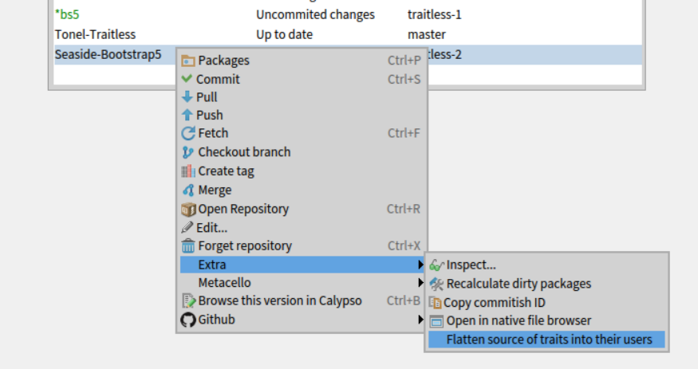

## Description

This package will add an Iceberg action to create a repository branch in which all the classes using Traits will be flattened.

This of course will introduce code duplication, but it is useful to export libraries to be used in Smalltalk dialects that doesn't have Trait support.

This will flatten the the methods of the traits into their users as well as the slots of stateful traits as instance variables of the classes that uses them.

## Installation


### Load the package 
```Smalltalk
Metacello new
	repository: 'github://emaringolo/pharo-tonel-traitless:master/src';
	baseline:'TonelTraitless';
	load.
```

### Adding the menu

I don't know of a dynamic way of registering the command into the repositories browser, so you have to modify the menu builder adding the command explicitly.

```Smalltalk
IceTipRepositoriesBrowser class>>#buildSelectionExtraCommandGroupWith: presenter for: aCommandGroup
    super buildSelectionExtraCommandGroupWith: presenter for: aCommandGroup.
    {       IceTipCalculateDirtyPackagesCommand.
            IceTipCopyCommitishCommand.
            IceTipOpenNativelyCommand.
            IceFlattenTraitsRepositoryCommand "<< ADD THIS"
    } do: [ :each | aCommandGroup register: each forSpec ]
```

## How to use it

On a clean repository, open the alternate menu and in the _Extra_ menu you'll find an option named _Flatten source of traits..._



This will create a new branch named `traitless` and commit the flattened version in that branch.

